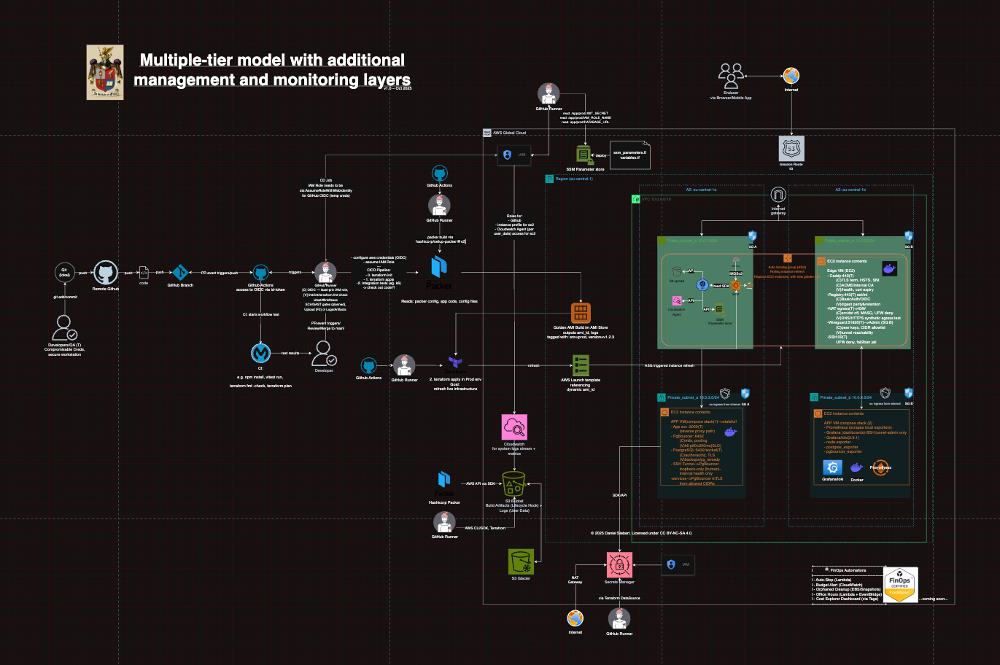

<h1 align="center">Daniel Siebert</h1>

<p align="center">
  <strong>Cloud FinOps · Infrastructure · AI Automation</strong><br/>
  Executive profile & consulting → <a href="https://siebert.cv">siebert.cv</a>
</p>

<p align="center">
  <a href="https://siebert.cv"></a>
  <a href="https://siebert.cv/en/projects"></a>
  
  
</p>

---

## What this profile is for

GitHub is my **technical workspace** — code, architecture, issues, and reproducible experiments.  
For CV, consulting, publications, and the full story: **[siebert.cv](https://siebert.cv)** (DE/EN).

---

## Flagship (private, in active use)

| Project | What it does |
|---------|----------------|
| [**Tender Agent**](https://siebert.cv/en/projects) | Multi-agent EU procurement pipeline — LangGraph, Grok (xAI), human-in-the-loop chapter drafting. **Private** while in production use; context on [siebert.cv](https://siebert.cv/en/projects). |

## Public repos

| Repo | What it does |
|------|----------------|
| [**AWS_grocery**](https://github.com/DanielSiebert-dev/AWS_grocery) | Terraform AWS stack — immutable EC2 rollouts, RDS, CI/CD deployment |
| [**InstaScraper**](https://github.com/DanielSiebert-dev/InstaScraper) | Modular scraping with proxy rotation, scheduling, SQLite persistence |
| [**GitHub-Stats-Visualization**](https://github.com/DanielSiebert-dev/GitHub-Stats-Visualization) | Custom language & activity charts for GitHub profiles |

Other production work (`layered-infra`, FinOps Lambdas, [siebert.cv](https://siebert.cv) codebase) stays private — architecture walkthroughs on request.

---

## Technical focus

| Area | Tools |
|------|-------|
| **Cloud & IaC** | AWS, Terraform, Docker, VPC, RDS, Lambda, IAM/OIDC |
| **FinOps** | Cost Explorer, tagging governance, budgets, auto-stop, right-sizing |
| **Engineering** | Python, TypeScript, Next.js, PostgreSQL, Playwright |
| **AI & automation** | LangGraph, Grok, n8n, Obsidian workflows, document pipelines |
| **Edge & ops** | Caddy, WireGuard, SSH+mTLS, GitHub Actions, k6, Terratest |

---

## Reference architecture

Private AWS environments I design around a **split edge + app plane** — TLS at the edge, east-west traffic in private subnets, FinOps jobs on the control plane:

<details>
  <summary><strong>CI/CD · Control · Data plane (click to expand)</strong></summary>

  <p align="center">
    
  </p>

  ```text
                        CI/CD PLANE                      CONTROL PLANE
+------------------+        |                     +------------------------------+
| Devs / QA        |        | OIDC trust          |  IAM / KMS / SSM             |
| pull requests    |  ----> | assumption policy   |  - Roles for CI & EC2        |
+------------------+        |                     |  - KMS keys for SSM          |
                            v                     |  - SSM params (registry/app) |
                    +------------------------+    +------------------------------+
                    | GitHub Actions Runner  |
                    | - Artifact build       |          DATA PLANE
                    | - Push to Registry     |          (east–west & north–south)
                    +-----------+------------+
                                |
                                | HTTPS push/pull (443)
                                v
==============================  AWS VPC (10.0.0.0/16)  ====================================
| Public Subnet (10.0.1.0/24)                                      Private (10.0.2.0/24)     |
|                                                                                            |
| +------------------------------------------+     mTLS/HTTPS proxy     +---------------+    |
| | Edge VM                                  | <------------------------ | App VM        |   |
| | - Caddy (TLS termination, SNI routing)   |                           | - App         |   |
| | - Split Registry (ext/int DNS)           |   outbound through NAT    | - PgBouncer   |   |
| | - NAT (masquerade, src/dst check off)    | ----------------------->  | - Postgres    |   |
| | - WireGuard (51820/UDP admin plane)      |                           +---------------+   |
| | - UFW default-deny; fail2ban sshd        |                                               |
| +------------------------------------------+                                               |
=============================================================================================
       |              |                  |                          |
       v              v                  v                          v
  Route53/NS     TLS issuance      SSM param reads             FinOps jobs
  (A/ALIAS)      (internal CA or   (pull credentials &         (Auto-Stop, Office Hours,
                 ACME public)      runtime config)             Orphaned Cleanup, Budgets)
  ```

</details>

---

## Start here

| If you want to… | Go here |
|-----------------|---------|
| **EU tenders + multi-agent AI** | [siebert.cv/projects](https://siebert.cv/en/projects) — Tender Agent (private flagship) |
| **Infra & FinOps patterns** | [Reference architecture](#reference-architecture) below |
| **Consulting / freelance** | [siebert.cv/consulting](https://siebert.cv/en/consulting) |
| **Clone & explore code** | [Public repos](#public-repos) above — e.g. `AWS_grocery`, `InstaScraper` |
| **Full CV, projects, publications** | [siebert.cv](https://siebert.cv) |

Architecture or EU-tender workflow questions → [consulting](https://siebert.cv/en/consulting) or email. Code feedback → **issues** on the public repo that fits.

---

## Connect

- **Consulting:** [cal.com/daniel-siebert-for-you](https://cal.com/daniel-siebert-for-you/30min)
- **LinkedIn:** [daniel--siebert](https://www.linkedin.com/in/daniel--siebert/)
- **Email:** [daniel@siebert.cv](mailto:daniel@siebert.cv)
- **Issues & PRs:** preferred for anything code-related

---

*Last updated: July 2026*